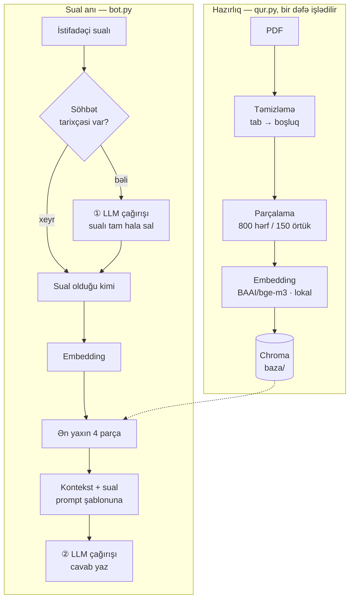

# Azərbaycan dilində sənəd üzərində RAG botu

Şirkətin daxili təlimatını **soruşula bilən** hala gətirir. 40 səhifəni oxumaq əvəzinə sual verirsən — cavab sənədin öz cümlələrindən gəlir, uydurma deyil.

```
Sual : Xırdalan anbarı axşam saat neçədə bağlanır?
Cavab: Xırdalan anbarı axşam saat 20:00-də bağlanır.

Sual : Bəs açılır?
Cavab: Xırdalan anbarı saat 08:00-də açılır.
```

İkinci sualda nə "Xırdalan", nə "anbar", nə "saat" sözü var. Sistem yenə də düz cavab verir — səbəbi aşağıda, **üçüncü sınma hekayəsində**.

> Bu repo yalnız işləyən kod deyil. Sistem qurulma prosesində **dörd dəfə sındı**. Hər sınmanın səbəbi, necə tapıldığı və necə düzəldildiyi aşağıda yazılıb — çünki əsl iş orada oldu.

---

## Hansı problemi həll edir

Hər şirkətdə heç kimin oxumadığı sənədlər var: əməliyyat təlimatı, tarif cədvəli, müqavilə şərtləri və.s

Bu sistem həmin sənədi cavab verən hala gətirir və **hansı hissədən götürdüyünü** göstərir.

Test sənədi: `araz_logistika_telimat.pdf` — 3 səhifəlik **uydurma** şirkət təlimatı (iş saatları, tariflər, qaytarma qaydaları, kompensasiya). Uydurma olması qəsdəndir: model bu faktları öz biliyindən bilə bilməz, deməli düz cavab verirsə həqiqətən sənədi oxuyub.

---

## Memarlıq



**Diqqət çəkən iki nöqtə:**

1. **Bir sual = iki LLM çağırışı.** Birincisi sualı axtarışa yararlı hala salır, ikincisi cavabı yazır. Axtarışa gedən sual ilə modelə göstərilən sual **fərqlidir**.
2. **Embedding lokaldır.** Sənədin mətni heç vaxt kənar serverə getmir — yalnız seçilmiş 4 parça cavab yazılması üçün göndərilir.

---

## Nəticələr

`test.py` səkkiz yoxlama işlədir. **Üç ardıcıl işlətmə: 24/24.**

| # | Nə yoxlanır | Sual | Nəticə |
|---|---|---|---|
| 1 | sadə fakt | Xırdalan anbarı axşam neçədə bağlanır? | ✅ 20:00 |
| 2 | oxşar bölmələri qarışdırmır | Dəyişdirmə sorğusu neçə gün ərzində? | ✅ 14 gün *(qaytarmanın 7 günü ilə qarışdırmadı)* |
| 3 | hesablama | Gəncəyə 4 kq neçəyə? | ✅ 7 × 1.8 = 12.6 |
| 4 | hərf səhvi | xirdlan anbari axsam necde baglanir | ✅ 20:00 |
| 5 | fərqli sözlər | paketi itirseler mene nə qədər pul verirler | ✅ 80%, maks 500 |
| 6 | uydurma yoxlaması | Gəncədə filial varmı? | ✅ "məlumat yoxdur" |
| 7 | kontekstsiz sual | *(əvvəlki sualdan sonra)* Bəs bağlanır? | ✅ 20:00 |
| 8 | nüanslı bənd | Sığorta xidməti neçəyə başa gəlir? | ✅ 2% — **ödənilən haqq**, kompensasiya deyil |

### ⚠️ Rəqəmi dürüst oxumaq

**24/24 "problem yoxdur" demək deyil.**

8-ci test bu repo-ya **keçməyəcəyi gözlənilərək** əlavə edilmişdi: iki gün əvvəl eyni sual, eyni sənəd, eyni `temperature=0` ilə model həmin bəndi **səhv** oxumuşdu — 2%-i kompensasiya sanmışdı.

Aradan heç bir düzəliş keçmədi. Model sadəcə bu üç işlətmədə düz cavab verdi.

Üç işlətmə az nümunədir: səhv ehtimalı 5-də 1 olsa belə, üç dəfədə görünməmə şansı ~50%-dir. **`24/24` = "üç dəfə olmadı", "heç vaxt olmur" deyil.**

Əlavə müşahidə: eyni suala fərqli işlətmələrdə **fərqli cümlələrlə** cavab gəldi. `temperature=0` təsadüfiliyi azaldır, sıfırlamır.

### Evaluation üsulunun məhdudiyyəti

Yoxlama **açar söz axtarışıdır**, məna anlamır:

- düz cavab başqa sözlə yazılsa → yanlış olaraq "keçmədi"
- səhv cavabın içində gözlənilən rəqəm olsa → yanlış olaraq "keçdi"

Kobud üsuldur, amma **ölçülən rəqəm verir** və kod dəyişəndə nəyin sındığını dərhal göstərir. Növbəti addım: cavabı ikinci modelə qiymətləndirtmək.

---

## Dörd dəfə sındı

### 1. Çirkli mətn — pypdf tab qoyurdu

PDF-dən çıxarılan mətndə sözlərin arasında boşluq yox, **tab** vardı: `Hər\tkuryer\tgündə`. Axtarış pozulurdu.

**Necə tapıldı:** parçaları ekrana çap edib gözlə baxaraq.
**Həll:** `qur.py`-da yükləmədən sonra `re.sub(r"[ \t]+", " ", ...)`.
**Dərs:** mətn çirklidirsə, model nə qədər güclü olsa da sistem işləmir.

### 2. ⭐ Embedding modeli azərbaycanca bilmirdi

Sistem "Sənəddə məlumat yoxdur" deyirdi — halbuki məlumat sənəddə vardı.

İlk model `paraphrase-multilingual-MiniLM-L12-v2` ~50 dil dəstəkləyir, **azərbaycanca onların arasında yoxdur** (türkcə var deyə qismən işləyirdi və bu, problemi gizlədirdi).

**Necə tapıldı:** `bax.py` — bütün parçaları oxşarlıq balı ilə sıralayan diaqnoz aləti. Düz parça **8-dən 6-cı sırada** idi, `k=4` isə yalnız ilk dördünü götürürdü. Yəni cavab bazada vardı, sadəcə modelə **çatmırdı**.

**Həll:** `BAAI/bge-m3` (100+ dil, lokal işləyir). Düz parça **1-ci sıraya** qalxdı, bal 0.672.

**Dəyişən tək bir sətir oldu.**

**Dərs:** RAG işləmirsə, ilk baxılacaq yerlərdən biri embedding modelidir. Bal fərqli modellər arasında müqayisə olunmur — hər modelin öz miqyası var.

### 3. ⭐ Yaddaş var idi, axtarış yenə sındı

Söhbət yaddaşı əlavə edildi. Sınaq:

```
Q1: Xırdalan anbarı neçədə açılır?   → 08:00 ✅
Q2: Bəs bağlanır?                    → "Sənəddə məlumat yoxdur" ❌
```

**Səbəb:** `similarity_search("Bəs bağlanır?")` — bu cümlədə nə "Xırdalan", nə "anbar", nə "saat" var. Baza əlaqəsiz parçalar gətirirdi.

**Model sualı anlayırdı, amma cavab ona çatmırdı.** Yaddaş modeli düzəltdi, axtarışı yox.

**Həll:** bazaya getməzdən əvvəl ikinci LLM çağırışı ilə sualı tam hala salmaq:

```
"Bəs bağlanır?" → "Xırdalan anbarı saat neçədə bağlanır?" → 20:00 ✅
```

**Dərs:** RAG-da bir sual = iki model çağırışı. `similarity_search`-ə yenidən yazılmış sual gedir, prompt-dakı `SUAL:` isə istifadəçinin öz sözləri qalır.

### 4. Rate limit — yalnız avtomatlaşdırma zamanı göründü

Testlər ard-arda işləyəndə Groq `429` qaytardı:

```
tokens per minute (TPM): Limit 8000, Used 6363, Requested 1652
```

Bu problem əl ilə söhbətdə **heç vaxt görünmür** — insan dəqiqədə 2-3 sual verir. Yalnız sistem avtomatik işləyəndə çıxır.

**Həll:** `bot.py`-da `invoke_et()` — limitə dəyəndə artan fasilələrlə (10s, 20s, 30s, 40s) 4 cəhd edir, alınmasa açıq xəta verir.

**Dərs:** kod düzgün olsa da kənar xidmət sistemin bir hissəsidir. Xəta sənin maşınında baş vermir, amma sistemi dayandırır.

---

## Quraşdırma

```bash
git clone https://github.com/jaffhunter99-gif/azerbaijani-pdf-rag.git
cd azerbaijani-pdf-rag

python -m venv .venv
.venv\Scripts\activate          # Windows
# source .venv/bin/activate     # Linux / macOS

pip install -r requirements.txt
```

Qovluqda `.env` faylı yarat:

```
GROQ_API_KEY=oz_acarin
```

*(Açar pulsuz alınır: console.groq.com)*

Sonra:

```bash
python qur.py       # bazanı qurur — bir dəfə, ~1-2 dəqiqə
python sohbet.py    # söhbət rejimi
python test.py      # 8 testi işlədir
python bax.py       # diaqnoz: parçaları balla sıralayır
```

⚠️ İlk işlətmədə `bge-m3` modeli (~2.2 GB) endirilir. `HF_TOKEN` xəbərdarlığı normaldır — endirmə sürətinə aiddir, sistemə təsir etmir.

---

## Fayllar

| Fayl | Rolu |
|---|---|
| `ayarlar.py` | bütün sabitlər — **tək həqiqət mənbəyi** |
| `qur.py` | PDF → təmizlə → parçala → embed → Chroma |
| `bot.py` | sistemin özəyi: retrieval + sualın yenidən yazılması + cavab |
| `sohbet.py` | söhbət rejimi *(məntiq saxlamır, `bot.py`-a müraciət edir)* |
| `sorus.py` | tək sual, mənbə göstərməklə |
| `test.py` | 8 testlik evaluation |
| `bax.py` | diaqnoz aləti — hansı parça neçənci sırada, hansı modelə gedir |
| `modeller.py` | Groq-da mövcud model adlarını çap edir |

### `ayarlar.py` niyə var

Embedding modelinin adı **iki yerdə** işlədilir: bazanı quranda (`qur.py`) və sual verəndə (`bot.py`). İkisi fərqli olsa — iki fərqli xəritə, uyğunsuz koordinatlar, mənasız nəticə. **Ən pisi: proqram xəta vermir.**

Ona görə hər sabit sistemdə **yalnız bir yerdə** yazılır. `sohbet.py` və `test.py` də prompt-u öz içində saxlamır — hər ikisi `bot.py`-dan götürür, yoxsa test zamanla real sistemdən fərqli bir şeyi yoxlamağa başlayardı.

---

## Texniki seçimlər

| Nə | Seçim | Səbəb |
|---|---|---|
| Embedding | `BAAI/bge-m3` *(lokal, ~2.2 GB)* | azərbaycanca dəstəkləyir; sənəd mətni kənara çıxmır |
| Vektor bazası | Chroma *(`baza/`)* | yerli fayl, əlavə server tələb etmir |
| Cavab modeli | Groq `openai/gpt-oss-120b`, `temperature=0` | sürət və qiymət |
| Parçalama | 800 hərf / 150 örtük | 3 səhifəlik sənəd üçün 8 parça |
| Axtarış | `similarity_search(k=4)` | 8 parçalı sənəddə yarısına baxır. Böyük `k` prompt-u zibillə doldurur, kiçik `k` cavabı itirir — bu dəyər standartdır, hələ tənzimlənməyib |
| Yaddaş | son 3 sual-cavab cütü | sualı tam hala salmaq üçün son bir neçə cümlə kifayətdir. Bütöv tarixçə həm prompt-u böyüdür, həm də köhnə mövzu yeni sualı çaşdırır |

---

## Bilinən məhdudiyyətlər

- **Nüanslı bəndlərdə model səhv edə bilir.** RAG uydurmanı azaldır, sıfırlamır *(yuxarıda 8-ci test)*.
- **Modelə gedən 4 parçadan adətən yalnız 1-i faydalıdır.** Qalan 3-ü həm zibil, həm xərcdir — `429` xətasının əsl səbəbi budur. Növbəti addım: reranking və ya dinamik `k`.
- **Evaluation açar sözə əsaslanır**, mənaya yox.
- **Yalnız bulud modeli.** Dövlət və bank kimi məlumatı perimetrdən çıxara bilməyən müştərilər üçün lokal rejim (Ollama) lazımdır — planlaşdırılıb, hələ edilməyib.
- **Bir sənəd üçün qurulub.** Çox sənədli iş üçün metadata və mənbə filtrləməsi əlavə olunmalıdır.


